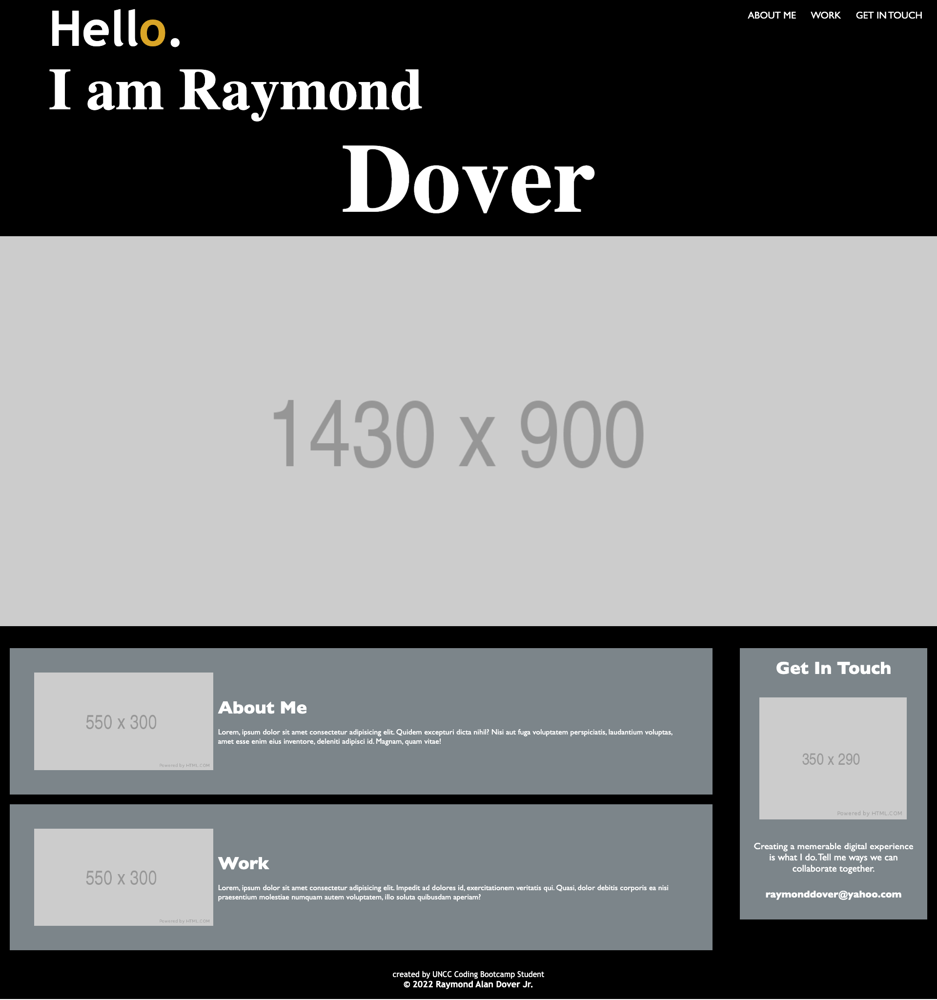

# My Portfolio

## Table of Contents

1. [Description](#description)
2. [Resources](#resources)
3. [Visuals](#visuals)
4. [Author and Acknowledgements](#author-and-acknowledgements)

## Description

The assignement required working on new code to create a portfolio for current & future use. Use the acceptance criteria as a guide for how you'll plan deadlines, sketch, and code your portfolio.

## Resources

-[LIVE SITE](https://raydover.github.io/my-portfolio/)

-[Repository](https://github.com/raydover/my-portfolio)

## Visuals

## Author and Acknowledgements

created & optimized by UNCC Coding Bootcamp Student, Raymond Dover
